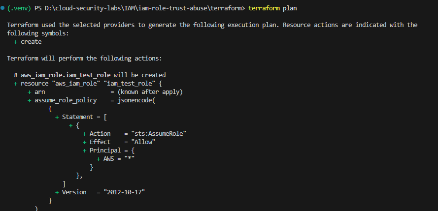
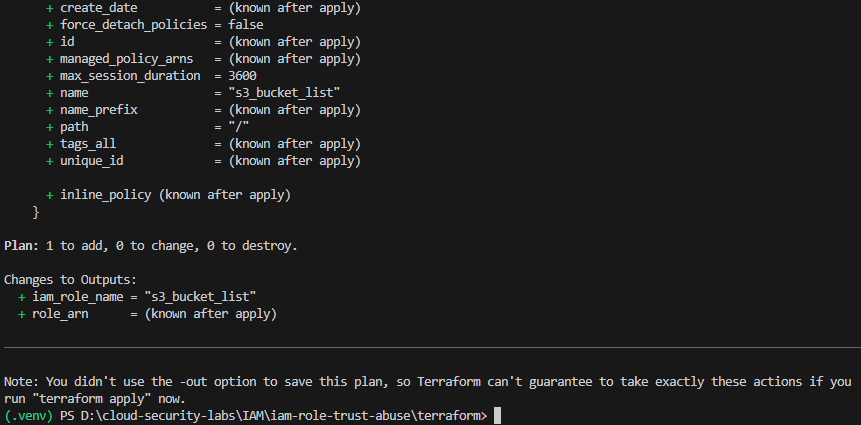
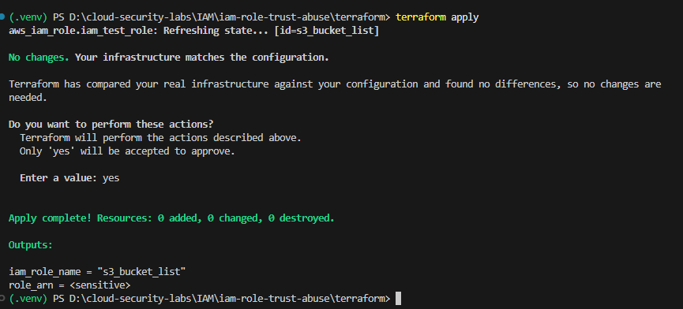
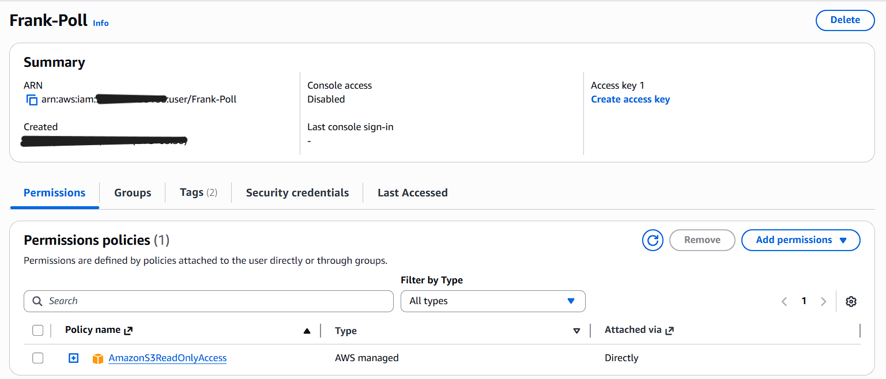
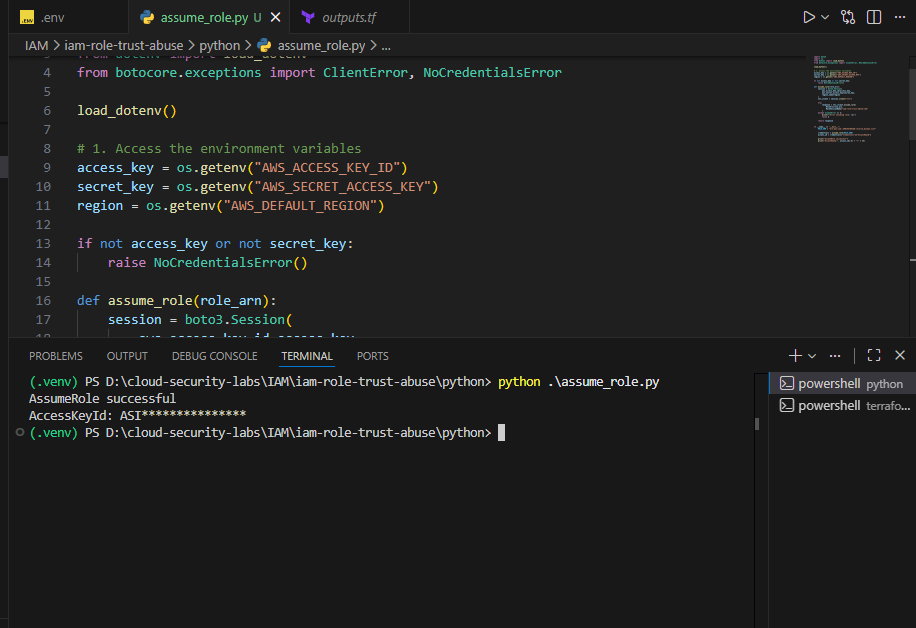
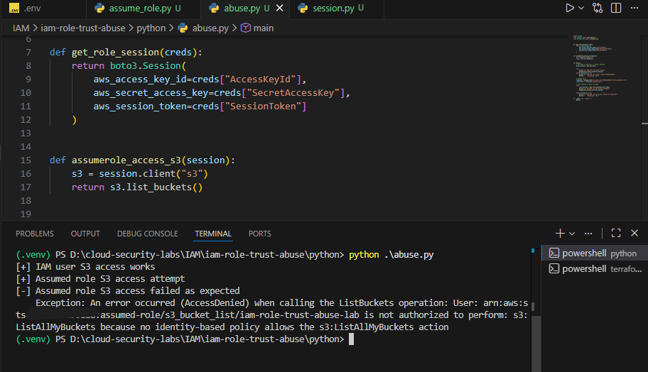
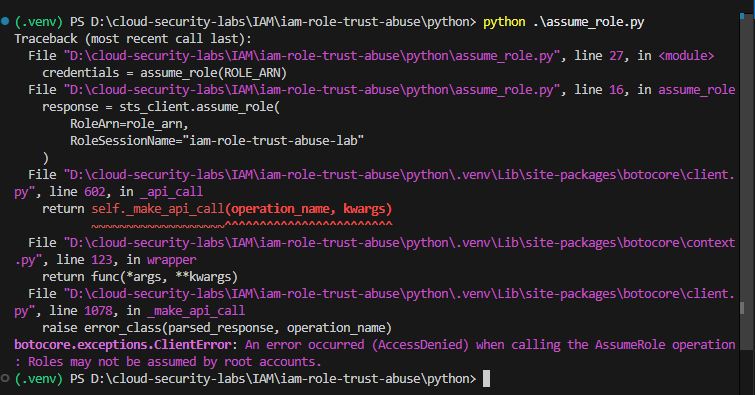
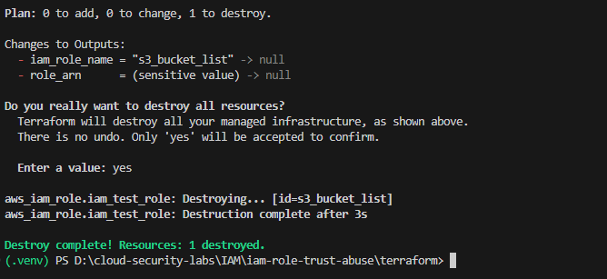

<div align="center">

# 🥉 IAM Role Trust Policy Misconfiguration → AssumeRole Abuse

**Cloud Security Case Study**  
*Terraform + Python + AWS STS*

</div>

---

## 📋 Table of Contents

- [Overview](#overview)
- [Security Context](#-security-context)
- [Root Cause](#-root-cause-weak-trust-policy)
- [Attack & Verification Flow](#-attack--verification-flow)
- [Why This Is Dangerous](#-why-this-configuration-is-dangerous)
- [Detection & Prevention](#️-detection--prevention-considerations)
- [Call to Action](#-call-to-action)
- [Key Takeaway](#-key-takeaway)
- [Getting Started](#-getting-started)
- [Contributing](#-contributing)
- [Disclaimer](#️-disclaimer)

---

## Overview

This case study demonstrates how a misconfigured IAM role trust policy can allow unintended role assumption using `sts:AssumeRole`.

Even when the role has **no permissions attached**, AWS STS still issues valid temporary credentials, creating a **latent security risk**. Once permissions are added at any point in the future, the same attack path becomes immediately exploitable without any change in attacker behavior.

**The goal of this lab is to show how IAM fails in real environments, not just how it works in theory.**


---

## 🔍 Security Context

In real AWS environments:

| Reality | Impact |
|---------|--------|
| IAM roles are shared across teams, services, and accounts | Multiple points of access |
| Trust policies are often written once and rarely revisited | Configuration drift |
| Permissions change frequently as systems evolve | Dynamic risk landscape |
| Security reviews tend to focus on permissions, not trust relationships | Blind spots in audits |

This combination makes trust policy misconfigurations particularly dangerous, as they often remain unnoticed until a future change turns them into a security incident.

---

## ⚠️ Root Cause: Weak Trust Policy

The IAM role is configured with the following trust policy:

```json
{
  "Effect": "Allow",
  "Principal": {
    "AWS": "*"
  },
  "Action": "sts:AssumeRole"
}
```

### What This Means

This configuration allows **any AWS principal** to assume the role, breaking the intended trust boundary.

**Critical Distinction:**

| Policy Type | Controls |
|-------------|----------|
| **Trust Policy** | Who can become an identity |
| **Permission Policy** | What that identity can do |

---

## 🎯 Attack & Verification Flow

### Step 1: Infrastructure Setup (Terraform)

Before testing the vulnerability, we deploy the misconfigured IAM role using Terraform.

**Terraform Plan - Review Configuration**

<p align="center">
    
</p>
<p align="center">
    
</p>

*The Terraform plan reveals the creation of an IAM role (`iam_test_role`) with a trust policy containing `AWS = "*"`, allowing any AWS principal to assume the role.*

---

**Terraform Apply - Deploy Infrastructure**

<p align="center">
    
</p>

*Infrastructure deployment completes successfully. The role ARN and name are now available for testing.*

---

### Step 2: Baseline Identity Verification

First, we verify the IAM user's permissions and establish baseline access.

**IAM User Console View**

<p align="center">
    
</p>

*The IAM user `Frank-Poll` has the `AmazonS3ReadOnlyAccess` managed policy attached, providing baseline S3 list permissions.*

---

### Step 3: Role Assumption Attack

The IAM user attempts to assume the vulnerable role using `sts:AssumeRole`.

**Successful AssumeRole Execution**

<p align="center">
    
</p>

*The `AssumeRole` call succeeds, returning temporary credentials including an `AccessKeyId` starting with `ASIA` (indicating STS-issued credentials). This confirms the trust policy vulnerability - any authenticated AWS principal can assume this role.*

---

### Step 4: Identity Switch (Critical Security Concept)

⚠️ **Important:** `AssumeRole` does **not** automatically switch the caller's identity.

To act as the role, a new AWS session must be explicitly created using the temporary credentials returned by STS, including the session token.

**This distinction is critical and commonly misunderstood in real-world environments.**

---

### Step 5: Permission Evaluation as Assumed Role

Using the assumed role identity, we attempt an S3 operation to test actual permissions.

**Access Denied - No Role Permissions**

<p align="center">
    
</p>

*The operation fails with `AccessDenied`. Notice the error shows the identity as `assumed-role/s3_bucket_list/iam-role-trust-abuse-lab` - confirming we're now operating as the assumed role, not the original IAM user.*

**Failed AssumeRole Attempt (Expected Behavior)**

<p align="center">
    
</p>

*This screenshot shows the expected error when attempting to assume a role from a root account - demonstrating that even with a wildcard trust policy, certain security controls still apply.*

---

### Step 6: Infrastructure Teardown

**Terraform Destroy - Clean Up**

<p align="center">
    
</p>

<p align="center">
    
</p>

*Responsible cleanup ensures no vulnerable resources remain in the AWS environment after testing.*

---

### 🔍 What This Demonstrates

| Observation | Security Implication |
|-------------|---------------------|
| ✓ AssumeRole succeeded | Trust policy is misconfigured |
| ✓ Temporary credentials issued | Valid STS session established |
| ✓ Identity changed to assumed-role ARN | Role assumption was successful |
| ✓ S3 operation denied | Role has no permissions (yet) |
| ⚠️ **Critical Point** | Trust boundary is broken - future permission changes instantly grant access |

---

## 💥 Why This Configuration Is Dangerous

Although the role currently has **no permissions**, the risk remains high because:

| Risk Factor | Consequence |
|-------------|-------------|
| Multiple principals can assume the role concurrently | Shared access vector |
| STS sessions appear legitimate in logs | Detection difficulty |
| Detection is difficult without focused monitoring | Visibility gaps |
| Any future permission attachment immediately enables access | **Latent risk** |
| No change in attacker technique is required | Zero-click exploitation |

### The Hidden Threat

This represents a **latent IAM risk**, not an immediate one.

Think of it as leaving a backdoor unlocked — even if the room is currently empty, the moment you put valuables in it, they're immediately accessible to anyone who knows about the door.

---

## 🛡️ Detection & Prevention Considerations

Effective mitigation requires focusing on **trust boundaries**, not just permissions.

### Defensive Measures

#### 1. Monitor CloudTrail for AssumeRole Events

Watch for:
- `userIdentity.type = AssumedRole`
- Unexpected source accounts
- Unusual role session names
- Geographic anomalies

#### 2. Restrict Trust Policies to Specific Principals

**Instead of:**
```json
{
  "Principal": {
    "AWS": "*"
  }
}
```

**Use:**
```json
{
  "Principal": {
    "AWS": "arn:aws:iam::123456789012:user/specific-user"
  }
}
```

#### 3. Enforce MFA Conditions

```json
{
  "Condition": {
    "Bool": {
      "aws:MultiFactorAuthPresent": "true"
    }
  }
}
```

#### 4. Limit Session Duration

Configure `MaxSessionDuration` to reduce credential validity window.

#### 5. Use AWS Config Rules

- `iam-role-managed-policy-check`
- Custom rules for trust policy validation

---

## 🚨 Call to Action

**Hands-On Challenge:**

1. Attach a minimal permission policy to the role (for example, S3 read access)
2. Re-run the same attack flow
3. Observe how access is immediately granted **without changing any attack logic**

This demonstrates how future configuration changes can instantly turn a trust issue into a breach.

**Expected Outcome:** The same `s3:ListBuckets` operation that previously failed will now succeed when using the assumed role credentials.

---

## 💡 Key Takeaway

<div align="center">

### Trust policies define the security boundary for role assumption.

### Once trust is broken, permissions determine blast radius.

</div>

**Remember:**
- Trust = **Who** can assume the role
- Permissions = **What** the role can do
- Both must be secured independently

---

## 🚀 Getting Started

### Prerequisites

- AWS account (isolated lab environment)
- Terraform installed (`>= 1.0`)
- Python 3.x with Boto3
- AWS CLI configured

### Setup Instructions

1. **Clone the Repository**
   ```bash
   git clone <repository-url>
   cd <repository-name>
   ```

2. **Deploy the Infrastructure**
   ```bash
   cd terraform/
   terraform init
   terraform apply
   ```

3. **Configure Python Environment**
   ```bash
   pip install -r requirements.txt
   ```

4. **Execute the Attack Simulation**
   ```bash
   python step1_baseline.py
   python step2_assume_role.py
   python step3_test_permissions.py
   ```

5. **Clean Up Resources**
   ```bash
   cd terraform/
   terraform destroy
   ```

### ⚠️ Important Notes

- Always use an **isolated AWS account** for security labs
- Never test in production environments
- Ensure all resources are destroyed after testing
- Review AWS costs before deployment

---

## 🤝 Contributing

Contributions, issues, and feature requests are welcome!

This is a learning-focused security lab, and community feedback improves clarity and accuracy.

**How to Contribute:**
- Open an issue for bugs or suggestions
- Submit pull requests for improvements
- Share feedback on educational value

---

## ⚠️ Disclaimer

This project simulates insecure AWS IAM configurations **for educational purposes only**.

- ✅ All testing must be performed in isolated lab accounts
- ✅ Never deploy these configurations in production
- ✅ The author assumes no responsibility for misuse
- ✅ Use responsibly and ethically

---

## 📄 License

This project is for educational purposes only. Use responsibly and ethically.

---

## 📞 Questions or Feedback?

If you have questions about this lab or suggestions for improvement, please open an issue or reach out through the repository's discussion board.

**Happy Learning! 🎓🔒**