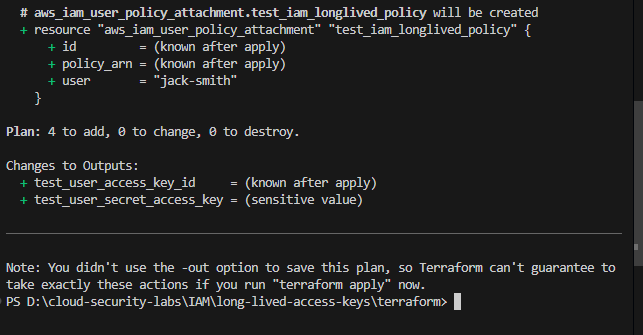
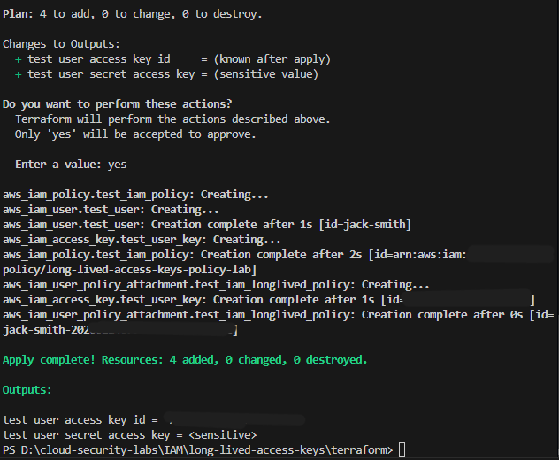
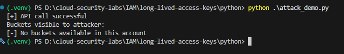
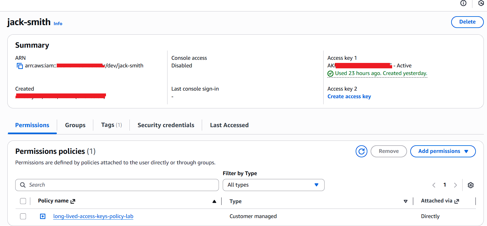
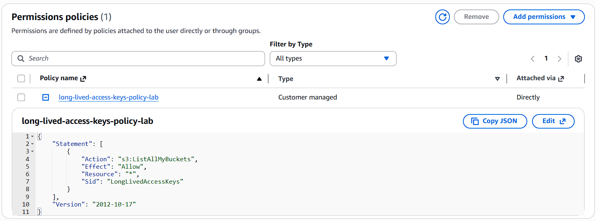
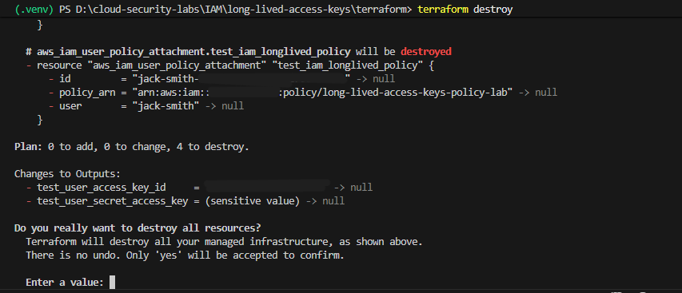
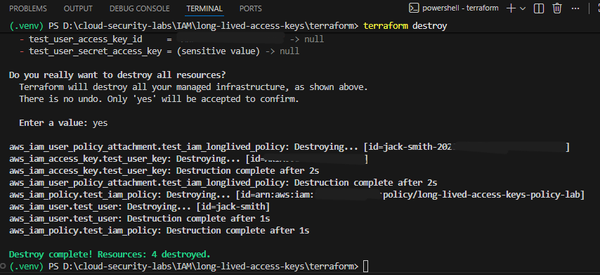

# 🥈 IAM User with Long-Lived Access Keys → Credential Leakage

**Realistic SOC & Cloud Security Misconfiguration Lab**  
*(Terraform + Python / Boto3)*

---

## TL;DR

Leaked IAM access keys create persistent AWS API access that bypasses MFA.  
Even minimal permissions represent a serious security risk.  
The correct fix is to eliminate static credentials and use IAM roles with STS-issued temporary credentials.

---

## Overview

This lab demonstrates a real-world AWS IAM misconfiguration where long-lived IAM access keys create a **persistent, silent attack surface** once credentials are leaked — even when permissions appear minimal and safe.

This is one of the most common AWS breach entry points and a frequent topic in SOC, cloud security, and incident response interviews.

Unlike privilege-escalation labs, this scenario focuses on **credential persistence, detection gaps, and cloud-native identity design**, which are often misunderstood by beginners.

---

## 🎯 Why This Scenario Matters

Security teams and interviewers care about this scenario because it:

- Directly maps to real AWS breaches seen in production
- Tests understanding of IAM users vs IAM roles
- Highlights cloud-native identity and access design
- Demonstrates risk without privilege escalation
- Is highly relevant to SOC monitoring and detection

This is **not theoretical** — credential leakage happens daily through development workflows.

---

## ❌ Misconfiguration

An IAM user is configured with:

- Long-lived access keys
- No key rotation
- Permissions that appear minimal and harmless
- API access that bypasses MFA

Common real-world credential leak sources include:

- Public GitHub repositories
- CI/CD pipeline logs
- Local `.env` files
- Developer laptops infected with malware
- Misconfigured backups or logs

---

## ⚠️ Why This Is Dangerous (Even with Minimal Permissions)

Even when permissions are tightly scoped:

- Access keys bypass MFA
- API access works from anywhere
- Compromise is silent
- Credentials remain valid until manually rotated or deleted
- Detection requires logging and monitoring, not IAM configuration alone

The problem is **persistent authenticated access**, not what the attacker can do today.

---

## 🧱 Lab Architecture

### Terraform – Misconfiguration Setup

Terraform is used to intentionally deploy the insecure state in a reproducible and auditable way.

This lab:

- Creates an IAM user
- Attaches a minimal permission policy (`s3:ListAllMyBuckets`)
- Generates a long-lived access key
- Avoids MFA to demonstrate why it does not protect API access

Terraform ensures the lab is:

- Reproducible
- Auditable
- Infrastructure-as-Code aligned

> Terraform does **not** perform the attack — it only creates the vulnerable condition.

---

### Python – Attack Demonstration (Boto3)

A Python script simulates an attacker who has obtained leaked credentials.

The script:

- Loads credentials from a local `.env` file
- Authenticates using `boto3`
- Performs a valid AWS API call (`ListBuckets`)
- Demonstrates successful access without MFA or console login

This proves:

- Credentials are valid
- API access works silently
- Console access is not required
- Minimal permissions still create risk

---

## 🧪 Attack Result (Observed Behavior)

Example output:
```
[+] API call successful
Buckets visible to attacker:
[-] No buckets available in this account
```
---

This result is expected.

- Successful API execution confirms authentication
- Empty results only reflect authorization scope
- The security risk still exists due to persistent access

---

## 🖼️ Screenshots (Proof of Execution)

This repository includes a small number of high-signal screenshots to validate execution:

- Terraform Apply (misconfiguration creation)
    <p align="center">
        
        
    </p>
- Python attack output (API access proof)
    <p align="center">
        
    </p>
- AWS Console view (IAM user and policy)
    <p align="center">
        
        
    </p>
- Terraform Destroy (responsible cleanup)
    <p align="center">
        
        
    </p>
**Security note:**  
All sensitive identifiers (account IDs, ARNs, access key IDs, timestamps) are redacted.  
All credentials were destroyed immediately after the demonstration.

Screenshots exist only to prove execution, not to expose secrets.

---

## 🛡️ Correct Mitigation (Cloud-Native Fix)

The correct solution is **not** to harden long-lived access keys.

### ✅ Recommended Fix

- Delete IAM access keys
- Avoid IAM users for workloads
- Use IAM roles with STS-issued temporary credentials
- Enforce MFA during role assumption (where applicable)
- Enable logging and monitoring (CloudTrail + CloudWatch)

You don’t secure bad credentials — **you eliminate them**.

---

## 🧠 Key Security Concepts Demonstrated

- Credential leakage
- Long-lived credentials
- MFA limitations
- Silent persistence
- Detection vs prevention
- IAM roles over users
- Cloud-native identity design

---

## Intended Audience

This lab is designed for:

- SOC analysts and cloud security learners
- Cloud security / SOC interview preparation
- Understanding credential-based attack paths
- Practicing cloud-native security thinking
- Security engineers transitioning from on-prem to cloud

---

## Disclaimer

This project simulates insecure AWS IAM configurations for educational purposes only.

- All testing must be performed in isolated lab accounts
- The author assumes no responsibility for misuse

---

## Getting Started

### Prerequisites

- AWS account (isolated lab environment)
- Terraform installed
- Python 3.x with Boto3
- AWS CLI configured

### Setup Instructions

1. Clone the repository
2. Navigate to the `terraform/` directory
3. Run `terraform init` and `terraform apply`
4. Configure the Python environment with credentials
5. Execute scripts in order: `whoami.py` → `enumerate.py` → `attack.py`
6. Clean up with `terraform destroy`

---

## Contributing

Contributions, issues, and feature requests are welcome.  
This is a learning-focused security lab, and community feedback improves clarity and accuracy.

---

## License

This project is for educational purposes only. Use responsibly and ethically.
