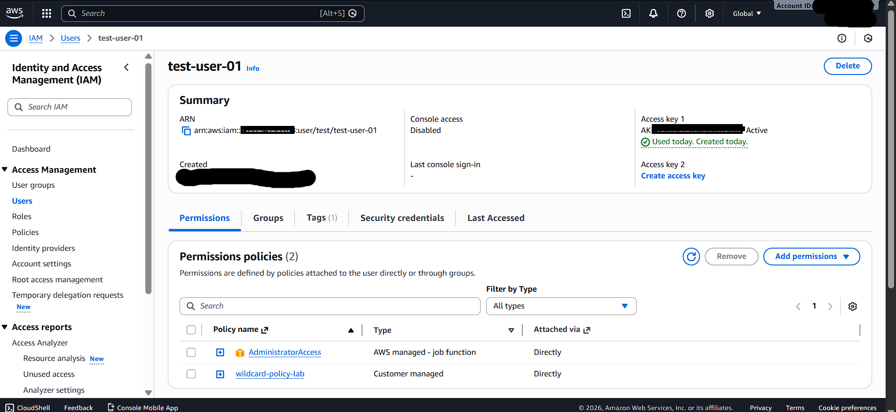
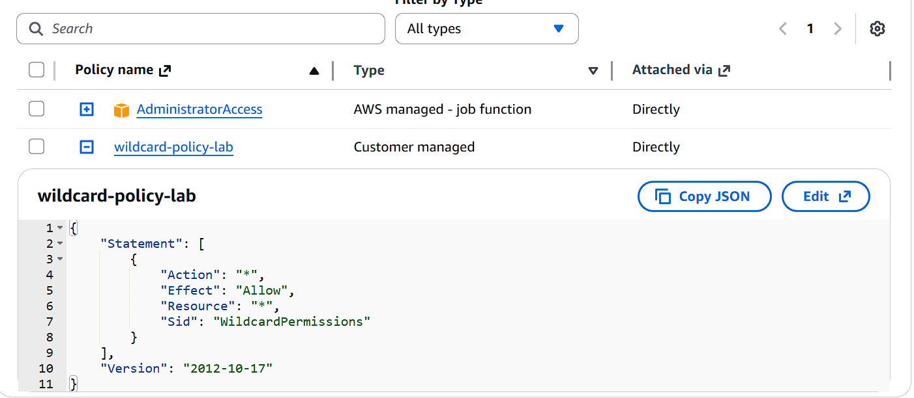
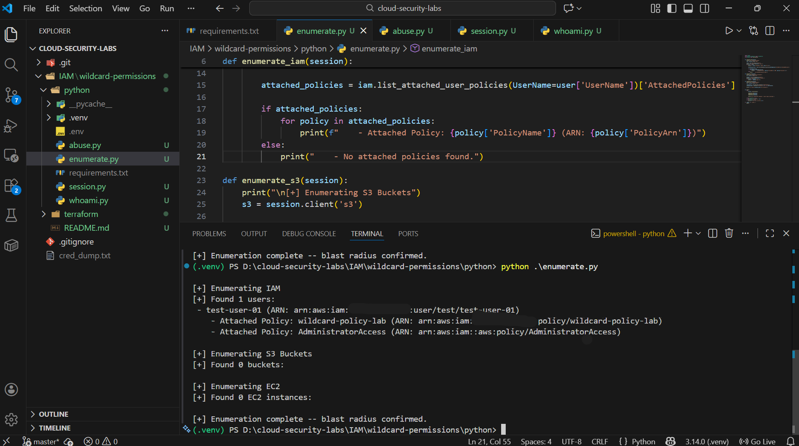
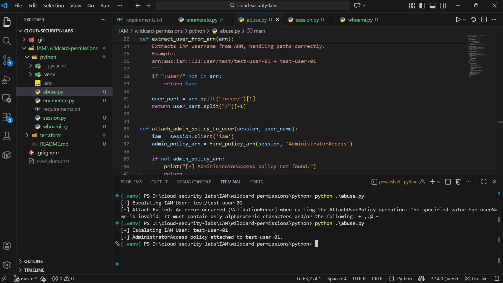
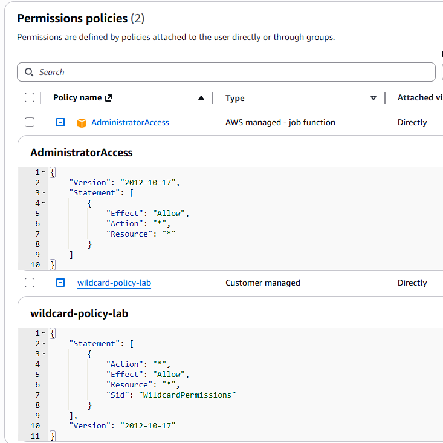
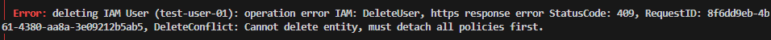
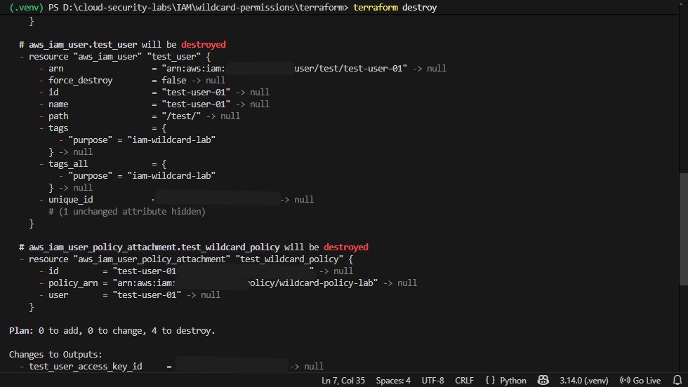
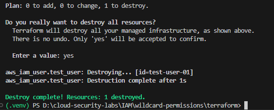

# AWS IAM Wildcard Privilege Escalation Lab

**Terraform + Python (Boto3) Security Case Study**

<!-- 📸 IMAGE 1: banner.png - Main banner with title and gradient background -->


## Overview

This project demonstrates a real-world AWS IAM misconfiguration where over-permissive wildcard permissions (`Action: "*"`, `Resource: "*"`) lead to full account compromise.

- **Using Terraform**, the vulnerable IAM setup is deployed in a controlled lab environment.
- **Using Python (Boto3)**, the misconfiguration is abused to simulate:
  - Identity discovery
  - Account-wide enumeration (blast radius)
  - IAM privilege escalation to full administrator access

The lab mirrors how real AWS breaches occur and how security engineers analyze, exploit (for learning), and remediate them.

### Why This Matters

Wildcard IAM policies are one of the most common misconfigurations found in real AWS breaches. In production environments, these over-permissive policies have been exploited to:

- **Exfiltrate sensitive data** from S3 buckets and databases
- **Create persistent backdoors** through additional IAM users or roles
- **Launch cryptomining infrastructure** that results in massive unexpected bills
- **Pivot to other AWS services** to expand the attack surface
- **Delete critical resources** causing business disruption

According to cloud security reports, IAM misconfigurations account for a significant percentage of cloud breaches, yet they require no technical exploit—just knowledge of AWS APIs. This lab teaches you to identify, understand, and prevent these dangerous misconfigurations before they reach production.

<!-- 📸 IMAGE 2: Permissions policies (2) showing both AdministratorAccess and wildcard-policy-lab attached directly -->


---

## ⚠️ Educational Use Only

This project is intended for **learning, defensive security awareness, and interview preparation**.

**DO NOT run against production AWS accounts.**

---

## Threat Model (What This Simulates)

**Initial condition:**

IAM user has a policy with:
```json
{
  "Effect": "Allow",
  "Action": "*",
  "Resource": "*"
}
```

**Attacker capability:**
- Valid AWS access key and secret key

**Outcome:**
- Account-wide enumeration
- IAM privilege escalation
- Full AWS account takeover

### Attack Flow (High-Level)

```text
Compromised AWS Credentials
        |
        v
[ whoami.py ]
Identity Confirmation
(AWS Account + IAM Principal)
        |
        v
[ enumerate.py ]
Read-Only Enumeration
- IAM users & policies
- S3 buckets
- EC2 instances
(Blast radius confirmed)
        |
        v
[ abuse.py ]
Privilege Escalation
- Attach AdministratorAccess
        |
        v
Full AWS Account Control
```

---

## Project Structure

```
cloud-security-labs/
└── iam/
    └── wildcard-permissions/
        ├── terraform/
        │   ├── provider.tf
        │   ├── variables.tf
        │   ├── iam_user.tf
        │   ├── iam_wildcard_policy.tf
        │   ├── iam_policy_attachment.tf
        │   └── .terraform.lock.hcl
        │
        ├── python/
        │   ├── session.py
        │   ├── whoami.py
        │   ├── enumerate.py
        │   ├── abuse.py
        │   ├── requirements.txt
        │   └── .env   (gitignored)
        │
        └── README.md
```

---

## Terraform – Vulnerable Infrastructure Deployment

### Purpose of Terraform

Terraform is used to intentionally deploy a misconfigured IAM setup in a reproducible and auditable way.

**Terraform does NOT perform the attack** — it only creates the vulnerable state.

### Terraform Resources Created

Terraform provisions:

- IAM user (`test-user-01`)
- IAM policy with wildcard permissions
- Policy attachment to the user

**Key design decisions:**
- Credentials are never hardcoded
- AWS CLI profile is used for authentication
- Access keys are created locally only (not committed)
- Terraform state and outputs are excluded from Git

### Terraform Deployment Flow (High-Level)

```text
terraform init
    |
    v
Load AWS Provider
(.terraform.lock.hcl)
    |
    v
terraform plan
    |
    |-- aws_iam_user            (test-user-01)
    |-- aws_iam_policy          (wildcard-policy-lab)
    |     Action   = "*"
    |     Resource = "*"
    |
    |-- aws_iam_user_policy_attachment
    |
    v
terraform apply
    |
    v
Misconfigured IAM State Created
```


### Misconfiguration Demonstrated

```json
{
  "Effect": "Allow",
  "Action": "*",
  "Resource": "*"
}
```

<!-- 📸 IMAGE 6: AWS Console - wildcard-policy-lab JSON expanded showing Action: "*", Effect: "Allow", Resource: "*" -->


This policy:
- **Violates least privilege** principle
- **Maximizes blast radius** across the entire AWS account
- **Enables IAM privilege escalation** without requiring exploits
- **Allows full account takeover** using legitimate AWS APIs

### Terraform Best Practices Applied

- Separate files for users, policies, and attachments
- Provider version locking via `.terraform.lock.hcl`
- No secrets committed
- Clear separation between infrastructure and abuse logic

---

## Python – IAM Misconfiguration Abuse (Boto3)

### Purpose of Python Phase

Python simulates post-compromise attacker behavior using legitimate AWS APIs. This mirrors how attackers operate after credentials are exposed.

### Python Attack Flow

#### 1. Identity Discovery (`whoami.py`)

Uses STS `GetCallerIdentity` to confirm:
- AWS account ID
- IAM principal
- Validity of compromised credentials

**This is always the first step after credential compromise.**

#### 2. Enumeration (`enumerate.py`)

Performs read-only reconnaissance to assess blast radius:
- IAM users and policies
- S3 buckets
- EC2 instances

Even in empty accounts, successful enumeration proves over-privileged access.

<!-- 📸 IMAGE 8: Terminal - terraform destroy plan showing aws_iam_access_key.test_key and aws_iam_policy.wildcard_policy will be destroyed -->


#### 3. Privilege Escalation (`abuse.py`)

Demonstrates IAM privilege escalation by:
- Attaching AWS-managed `AdministratorAccess`
- Escalating the compromised user to full admin

This confirms complete account takeover without exploiting vulnerabilities — **only misconfiguration**.




### Core Python Design Principles

**Centralized Session Handling**

All AWS interactions use a single session defined in `session.py`.

Benefits:
- Prevents identity confusion
- Avoids accidental default profile usage
- Mirrors real red-team tooling

**Identity → Enumeration → Exploitation**

The attack flow strictly follows:
1. Identity confirmation
2. Visibility assessment
3. Privilege escalation

This is how real incidents unfold.

---

## Key Challenges Faced & Solved

### IAM State Drift

**Problem:**
- `AdministratorAccess` was attached using Python
- Terraform did not track this change
- `terraform destroy` initially failed due to unmanaged attachment

**Resolution:**
- Manual detachment
- Re-run `terraform destroy`





**Lesson learned:** Terraform only manages what it creates — anything outside causes state drift.

### IAM Username Parsing

**Problem:** IAM usernames may include paths:
```
arn:aws:iam::123:user/team/test-user-01
```


Using the full path when calling IAM APIs (such as `AttachUserPolicy`) results in validation errors, because IAM expects only the final username segment.

**Fix:**  
The script safely extracts the username by splitting on `/` and using the final segment (e.g. `test-user-01`).

This ensures compatibility with both flat and path-based IAM usernames and prevents privilege escalation failures due to malformed usernames.


### Secure Credential Handling

- `.env` file used locally
- `.env`, outputs, and state files are gitignored
- No secrets committed at any stage

---

## Cleanup & Remediation

After documentation:

1. `terraform destroy` is used to remove all lab resources
2. Any manually attached policies are detached
3. No residual access remains

This demonstrates **responsible security testing**.



---

## Security Lessons Learned

- **Wildcard IAM permissions are never safe** in production environments
- **Enumeration alone confirms compromise** and reveals the blast radius
- **IAM privilege escalation often requires no exploit** — just API knowledge
- **Infrastructure-as-Code highlights misconfigurations clearly** before deployment
- **Attack simulation + cleanup shows real security maturity**

---

## Intended Audience

This project is designed for:

- Cloud security learners
- SOC / Cloud Security Engineer interview preparation
- Understanding IAM privilege escalation paths
- Practicing secure AWS automation
- Learning attacker-style thinking for defense

---

## Disclaimer

This project simulates insecure AWS IAM configurations for **educational purposes only**.

- All testing must be performed in **isolated lab accounts** owned by the user.
- The author assumes **no responsibility for misuse**.

---

## Getting Started

### Prerequisites

- AWS account (isolated lab environment)
- Terraform installed
- Python 3.x with Boto3
- AWS CLI configured

### Setup Instructions

1. Clone the repository
2. Navigate to `terraform/` directory
3. Run `terraform init` and `terraform apply`
4. Configure Python environment with credentials
5. Execute Python scripts in order: `whoami.py` → `enumerate.py` → `abuse.py`
6. Clean up with `terraform destroy`

---

## Contributing

Contributions, issues, and feature requests are welcome! This is a learning project, and community input helps improve security education.

---

## License

This project is for educational purposes. Use responsibly and ethically.

---

**Built with ❤️ for cloud security education**